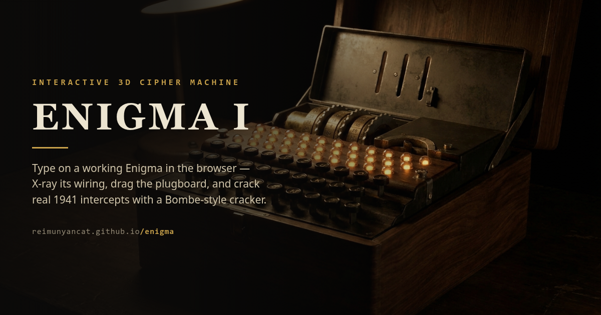

# Enigma

A 3D interactive Enigma I cipher machine that runs in the browser. One C++ cipher engine is shared by the CLI and the web (WebAssembly) front end.



https://reimunyancat.github.io/enigma/

## Features

- **3D machine** — wooden case, brass fittings, lids that open, keys that sink, lamps that answer. Three.js with on-demand rendering and automatic quality scaling.
- **X-ray wiring view** — the case turns transparent and exposes all 26 internal wires; the last keypress traces its exact current path.
- **Drag-and-drop plugboard** — drag a cable between two sockets to swap letters; tap a plugged socket to pull its cable.
- **Crack mode** — a web worker brute-forces every start position (optionally rotor order and reflector too) and ranks candidates by IoC + frequency fit, or breaks any message instantly with a known-plaintext crib.
- **Historical intercepts** — six real Wehrmacht messages from 1941 with keys recovered by modern cryptanalysis (Ostwald & Weierud, Cryptologia 2017). Decrypt them with the day's key, crack the long one by statistics, crib-crack the short ones.
- **Share links** — the full machine state plus a message, encoded in the URL hash.
- **Try me** — a hands-off typing demo for first-time visitors.
- English by default, with a Korean UI toggle.

## Structure

- `enigma.hpp` — the cipher engine (rotors, reflector, plugboard). Single source of truth shared by the CLI and WASM.
- `main.cpp` — CLI entry point.
- `wasm.cpp` — exposes the engine to the browser via Emscripten (`enigma_init` / `enigma_press` / `enigma_positions` / `enigma_trace`).
- `web/` — Vite + Svelte + TypeScript + Three.js front end.

## Running

### CLI

```sh
g++ -std=c++17 -O2 main.cpp -o enigma
./enigma
```

### Web

```sh
cd web
npm install
npm run dev      # dev server
npm run build    # static build
```

The WASM module (`web/src/enigma.mjs`) is prebuilt and committed, so Emscripten is not required just to run the web app. You only need Emscripten to recompile `wasm.cpp` after changing the engine.